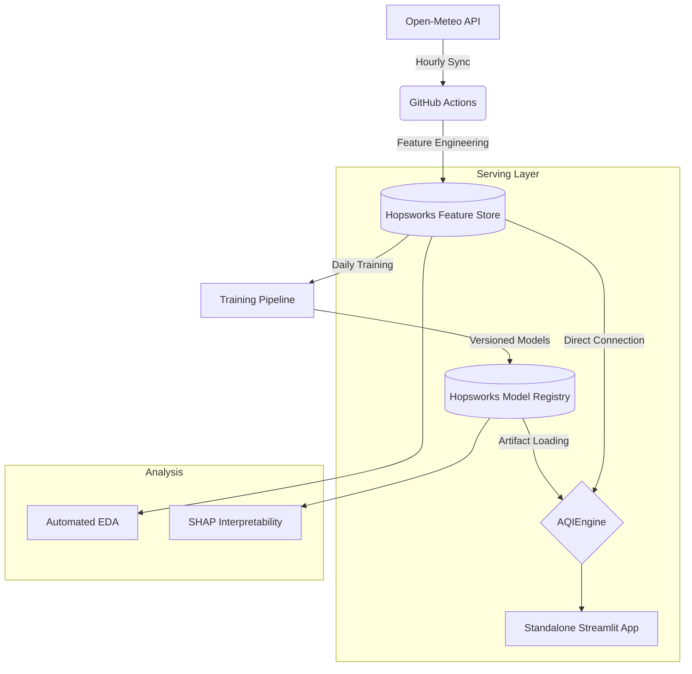

# 🌬️ Pearls AQI Predictor: Karachi

[](https://airqualityindexpredictor10pearlsproject.streamlit.app/)
[](https://www.hopsworks.ai/)
[](https://github.com/features/actions)

An end-to-end, serverless machine learning system designed to forecast the **Air Quality Index (AQI)** for Karachi, Pakistan. This project leverages a modern MLOps stack to provide 3-day predictive insights, automated data pipelines, and a premium interactive dashboard.

---

## 🚀 Live Demo
Experience the real-time dashboard here: **[Karachi AQI Predictor](https://airqualityindexpredictor10pearlsproject.streamlit.app/)**

---

## ✨ Key Features
*   **Real-time Monitoring**: Fetches live pollutant data (PM2.5, PM10, NO2, etc.) from Open-Meteo.
*   **3-Day ML Forecast**: Horizon-specific predictions (1d, 2d, 3d) using a multi-model suite.
*   **Automated MLOps**: GitHub Actions handle hourly feature updates and daily model retraining.
*   **Serverless Architecture**: Built on Hopsworks (Feature Store) and Streamlit Cloud—zero server maintenance.
*   **Hazard Alerts**: Visual pulsating alerts and badges for hazardous AQI levels (>150).
*   **Model Transparency**: Integrated SHAP importance and EDA suite for "glass-box" AI.

---

## 🏗️ System Architecture
The project follows a **dual-mode serving architecture**, allowing for both local development and cloud-native execution:



---

## 🧪 Feature Engineering (The "V5" Set)
Our models are powered by the **Version 5** feature group, specifically engineered for urban pollution dynamics:
*   **Temporal Encodings**: Cyclical Sin/Cos transforms for months and weekdays.
*   **Momentum Features**: Trend indicators like `aqi_diff` and `pm2_5_diff`.
*   **Autoregressive Lags**: 1-day and 2-day lags for all major pollutants.
*   **Rolling Aggregates**: 3-day and 7-day smoothing windows.
*   **Physical Ratios**: `PM2.5 / PM10` ratios to detect particle composition shifts.

---

## 📊 Model Suite & Performance
We evaluate five distinct architectures daily. The current champion for 1-day forecasts is **Ridge Regression**.

| Model | 1-Day R² | 2-Day R² | 3-Day R² |
| :--- | :---: | :---: | :---: |
| **Ridge Regression** | **0.866** | 0.471 | 0.387 |
| **HGBR** | 0.819 | 0.438 | 0.329 |
| **Random Forest** | 0.819 | 0.411 | 0.355 |
| **MLP (Deep Learning)** | 0.750 | 0.257 | -0.022 |
| **Decision Tree** | 0.705 | 0.375 | 0.148 |

---

## 🛠️ Installation & Setup

### 1. Prerequisites
*   Python 3.11 or 3.12 (3.13 supported in Cloud)
*   [Hopsworks Account](https://app.hopsworks.ai/) (Free Tier)

### 2. Local Setup
```bash
# Clone the repository
git clone https://github.com/taqiKaAccount/AirQualityIndexPredictor.git
cd AirQualityIndexPredictor

# Create virtual environment
python -m venv .venv
source .venv/bin/activate  # Windows: .venv\Scripts\activate

# Install dependencies
pip install -r requirements.txt
```

### 3. Environment Variables
Create a `.env` file in the root:
```env
HOPSWORKS_API_KEY=your_api_key_here
HOPSWORKS_PROJECT=your_project_name
```

### 4. Run the App
```bash
python -m streamlit run frontend/app.py
```

---

## ☁️ Deployment (Streamlit Cloud)
To deploy your own version:
1. Push this repo to GitHub.
2. Connect to [Streamlit Community Cloud](https://share.streamlit.io/).
3. Add your `HOPSWORKS_API_KEY` to the **Secrets** manager.
4. Set the main file path to `frontend/app.py`.

---

## 📝 License & Credits
Developed as part of the **10Pearls Shine Internship Program**.
Data provided by [Open-Meteo](https://open-meteo.com/).